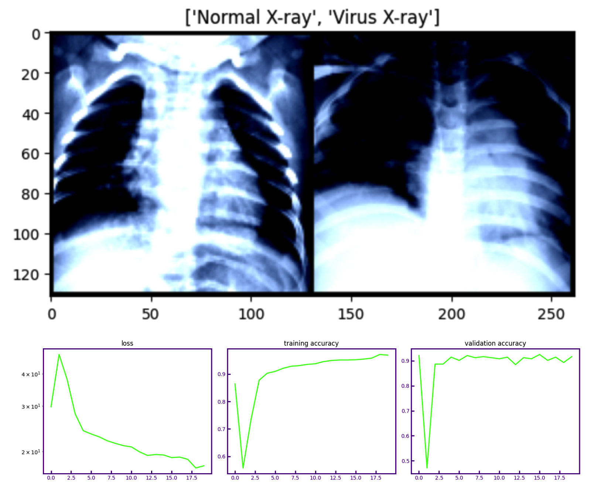

# Chest X-Ray Classification Using ViT

This project focuses on classifying chest X-ray images into normal or virus categories using a Vision Transformer (ViT) model. It includes scripts for setting up the environment, preprocessing the data, training the model, and testing its performance.



## Environment Setup

To replicate the environment needed for this project, follow these steps:

**Create a Virtual Environment:**

Run the install_requirements.sh script to create a new virtual environment and install the necessary packages from requirements.txt.

```bash
bash install_requirements.sh

source activate vit
```

## Data Preparation

The prepare_data.py script processes the chest X-ray dataset by organizing images into training and testing directories.

**Ensure Kaggle API Setup:**

Make sure you have a Kaggle API token (kaggle.json) placed in the specified directory (for example, in Colab, `/content/drive/MyDrive/Kaggle`).

**Run the Script:**

Execute the following command to start the data preparation process:

```bash
python root_directory/dataset/prepare_data.py
```

## Model Training

Use the train.py script to train the Vision Transformer model on the prepared dataset.

**Start Training:**

Run the training script using:

```bash
python root_directory/src/train.py
```

**Model Checkpoints:**

The trained model will be saved as vit_10.pth in the specified directory. Ensure you have the necessary write permissions.

## Model Testing

After training, you can evaluate the model's performance on the test dataset using the test.py script.

**Evaluate the Model:**
Execute the test script with

```bash
python root_directory/src/test.py
```

View Results:
The script will output the model's accuracy on the test dataset.

## Notes

Make sure you have the correct paths set up for your data, model checkpoints, and Kaggle API token.
The virtual environment helps in maintaining a clean workspace and should be used whenever working on the project.  

Adjust the scripts as needed based on your specific directory structure and setup.

## Troubleshooting

If you encounter any issues with package versions or conflicts, try updating the `requirements.txt` file and reinstalling the packages.  

For problems related to Kaggle API access, ensure your `kaggle.json` is in the correct location and has the appropriate permissions.

